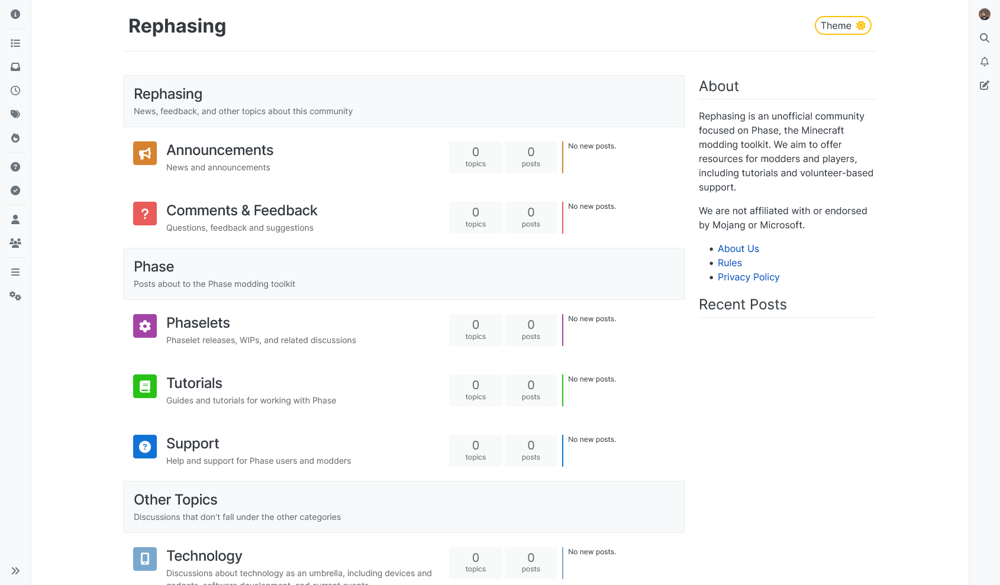

# Forked: Harmony theme for NodeBB

This is a fork of [the NodeBB Harmony theme](https://github.com/NodeBB/nodebb-theme-harmony) that adds some changes
we needed at https://rephas.ing.

We don't have any distribution method for this fork, and this is by design.

## Sections

Categories marked as sections now display as section headers, instead of normal categories that you can't click.
All you need to do is mark the category as a section and give it a description.

Section headers don't show child categories. 
Instead, sort them after the sections.

Click to view a screenshot

